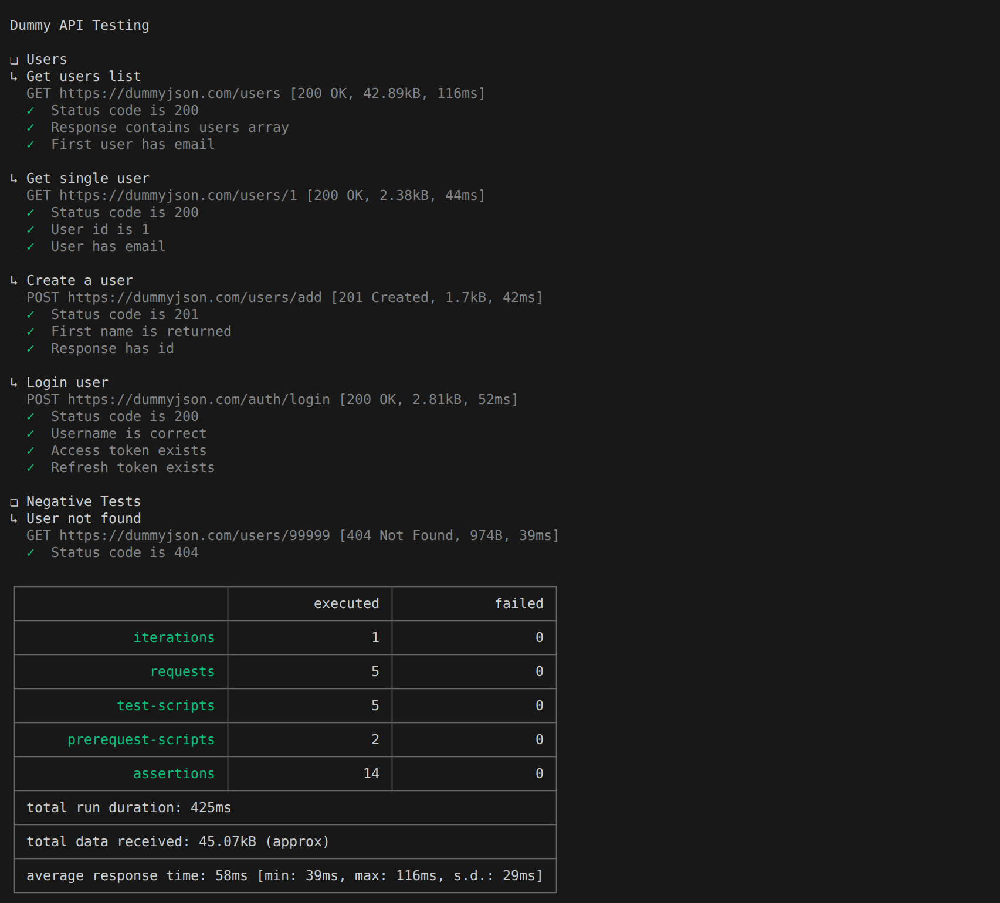

# DummyJSON API Tests

Simple API testing project using **Postman**, **JavaScript**, and **Newman**.

## API

https://dummyjson.com

## Tested Endpoints

* `GET /users`
* `GET /users/{id}`
* `POST /users/add`
* `POST /auth/login`
* Negative test: `GET /users/99999`

## Tech Stack

* Postman
* Newman
* JavaScript

## Run Tests

Install Newman:

```
npm install -g newman
```

Run collection:

```
newman run collections/dummy-api-tests.postman_collection.json -e environments/test.postman_environment.json
```

Or run with npm:

```
npm test
```

